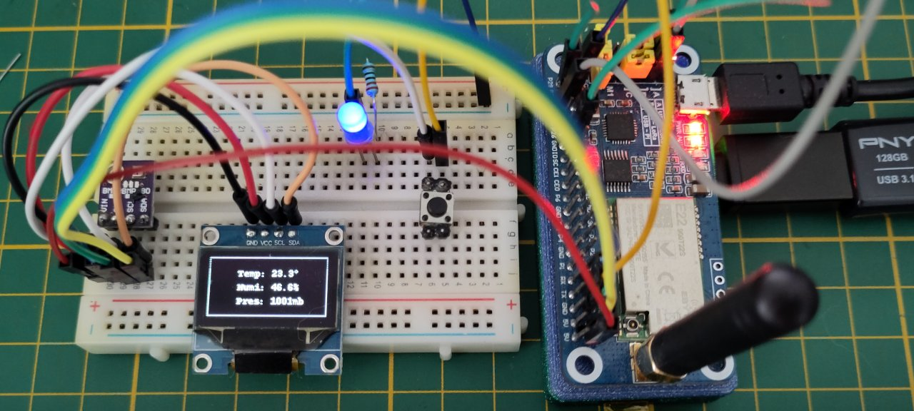

# GPIO usage examples (for the MQ-Pro)
This guide assumes you have a correctly installed and set up board, with the correct device tree (plus overlays) to expose the pins you want to use.

*Caveat:* notes here are biased towards Python usage, since that is what I will be using in my projects.

## Common
You need to install the GPIOd package to allow access to the raw GPIO devices: 
```
$ sudo apt install gpiod
$ sudo reboot
```

## General Purpose GPIO (digital read/write)
**You do not need to use a custom Device Tree in order to use digital IO**
* The 'default' device tree for the MQ pro has 26 free pins to use!

Look at the great guide here: https://worldbeyondlinux.be/posts/gpio-on-the-mango-pi/

It does a better job of explaining this than I can do in a short guide.

## PWM
**working**: I have tested using a simple LED attached to a GPIO pin.

**Software PWM**: Does not need a device tree modification

`lgpio` provides a software (bit-bang) PWM solution that can be used on any free pin, and does not need a device tree modification.

**Hardware PWM**: There are eight hardware PWM timers available, these can be mapped to some of the pins on the GPIO connector.

The available hardware PWM mappings are somewhat limited, see the diagram in the main README to determine which pins on the GPIO connector can be used.
- The example below uses (legacy) `/sys/class` control, which in turn needs root access. PWM control from userland seems like a WIP for linux at present.

The following needs to be run as root. It uses `pwm2` (the `lora` example device tree attaches this to pin 31 on the GPIO connector).

First, export the PWM interface:
```
# echo 2 > /sys/class/pwm/pwmchip0/export
```
- The node for the interface wil appear at `/sys/class/pwm/pwmchip0/pwm2/`

Set a default period (10μs) and duty cycle (5μs, 50%):
```
# echo 10000 > /sys/class/pwm/pwmchip0/pwm2/period`
# echo 5000 > /sys/class/pwm/pwmchip0/pwm2/duty_cycle`
```
After setting the default you can enable it with:
```
# echo 1 > /sys/class/pwm/pwmchip0/pwm2/enable`
```
You can stop and detach the interface with: `# echo 2 > /sys/class/pwm/pwmchip0/unexport`

The following is a shell script that implements a crude LED fader:

```bash
#!/bin/bash
# PWM silly fader
#
pwm="/sys/class/pwm/pwmchip0/pwm2"

echo normal > $pwm/polarity
echo 10000 > $pwm/period
echo 1 > $pwm/enable
while true ; do
    for p in 40 100 400 1000 4000 10000 6000 1200 600 120 60 0 ; do
        echo -n "."
        echo $p > $pwm/duty_cycle
        sleep 0.25
    done
    echo
done
```
See the [kernel PWM API guide](https://www.kernel.org/doc/html/latest/driver-api/pwm.html#using-pwms-with-the-sysfs-interface) for the parameters we set to assign and control the pin.

## I2C
**Working**: I have read temperature, pressure and humidity from a BME280 sensor connected to pins `3` and `5`, and output that to a OLED display on the same bus. See the python example below.

Install `i2c-tools` and add your user to the `i2c` group to access the device nodes.
```console
$ sudo apt install i2c-tools
$ sudo usermod -a -G i2c <username>
```
Reboot at his point, after the reboot you should have devices in the `/dev` tree for i2c busses. Use `i2cdetect` to scan them for attached devices.
* Note that the i2c busses are numbered sequentially, not by their hardware number. The Device Tree I am using here has `I2C0` and `I2C3` enabled; but they are named `i2c-0` and `i2c-1` respectively in `/dev`.
```console
$ ls -l /dev/i2c*
crw-rw---- 1 root i2c 89, 0 Sep 23 21:17 /dev/i2c-0
crw-rw---- 1 root i2c 89, 1 Sep 23 21:17 /dev/i2c-1
$ i2cdetect -l
i2c-0	i2c       	mv64xxx_i2c adapter             	I2C adapter
i2c-1	i2c       	mv64xxx_i2c adapter             	I2C adapter
$ i2cdetect -y 0
     0  1  2  3  4  5  6  7  8  9  a  b  c  d  e  f
00:                         -- -- -- -- -- -- -- -- 
10: -- -- -- -- -- -- -- -- -- -- -- -- -- -- -- -- 
20: -- -- -- -- -- -- -- -- -- -- -- -- -- -- -- -- 
30: -- -- -- -- -- -- -- -- -- -- -- -- 3c -- -- -- 
40: -- -- -- -- -- -- -- -- -- -- -- -- -- -- -- -- 
50: -- -- -- -- -- -- -- -- -- -- -- -- -- -- -- -- 
60: -- -- -- -- -- -- -- -- -- -- -- -- -- -- -- -- 
70: -- -- -- -- -- -- 76 --                         
```
You can see that interface `i2c-0` has a BME280 device at address`0x76`, and a SSD1306 OLED screen at `0x3c`.

## SPI
**Working?**: When I enable SPI1 in the device tree a device is registered at `/sys/devices/platform/soc/4026000.spi/`
* It lists it's driver (correctly) as `sun6i-spi` and is a bus master.
* Kernel drivers that use SPI via `pinctl` should be able to use this.
* But no block device appears at /dev/spi*.
  * Normally `spi-tools` provides userland support via the /dev/spi* device.
* I do not plan to use SPI so I have not tested further.

---------------------------------------------------------

# Python demo
`GPIO-demo.py` is a demo using I2C to read data from a BME280 environmental sensor, and then display it on a SSD1306 OLED display.
- It will be expanded with hardware PWM and digital pin input/interrupt code later.
- All the install steps here (making the venv, `apt` and `pip`) are tediously slow on the MQ Pro.

For the demo we need to install some dependencies via `apt`.
* I am using a [virtual environment](https://docs.python.org/3/tutorial/venv.html), rather than installing the python libraries globally.
```bash
# Dependencies needed by pip install.
$ sudo apt install python3-venv python3-dev libjpeg-dev liblgpio-dev swig build-essential

# Create virtualenv at './env' and activate it
# - exit with `deactivate`
# - removing the `./env` directory+contents deletes the venv
$ python3 -m venv env
$ source env/bin/activate

# Upgrade pip then install the libraries we use
(env) $ pip install --upgrade pip
(env) $ pip install --upgrade pimoroni-bme280
(env) $ pip install --upgrade luma.oled
(env) $ pip install --upgrade lgpio       # <- Not yet used in demo

# Run the demo
(env) $ python GPIO-demo.py
```

## Hardware


This is my test setup; A bme280 and SSD1306 OLED on the I2C bus, a blue LED is on a PWM pin and a pushbutton on a free digital IO pin. The MQ Pro itself is hidden underneath the (blue) LoRa HAT.
#### Work In Progress ####
The demo runs well, but still needs expanding with lgpio and pwm control

---------------------------------------------------------

# Extra!
## Status LED:
The onboard (blue) status LED is attached to gpio `PD18`, and can be controlled via the sys tree:

`$ sudo sh -c "echo 1 > /sys/devices/platform/leds/leds/blue\:status/brightness"` to turn on

`$ sudo sh -c "echo 0 > /sys/devices/platform/leds/leds/blue\:status/brightness"` to turn off

You can make it flash as network traffic is seen with:

`$ sudo sh -c "echo phy0rx > /sys/devices/platform/leds/leds/blue\:status/trigger"`

Other control options are available, `$ sudo cat /sys/devices/platform/leds/leds/blue\:status/trigger` shows a list and the current selection. Most do not work or are not very useful; ymmv.
- `PD18` can also be re-mapped to `pwm-2` in a modified device tree if you want to manually control the LED and vary it's brightness.
- `PD18` is also used as the `LED_PWM` pin on the DSI/LVDS output


## Onboard CPU temperature sensor:
```console
$ sudo apt install lm-sensors
$ sensors
cpu_thermal-virtual-0
Adapter: Virtual device
temp1:        +19.4°C
```
**HOWEVER**: This is nonsense.. 

I'm testing with the board in an enclosure; and the attached BME280 sensor is showing room temp outside the enclosure as 22°C.
- The CPU is definately running hotter than 19° 🤦
- ¿Check out the device tree, maybe a bad offset. Or some kind of calibration/reference voltage needed?
