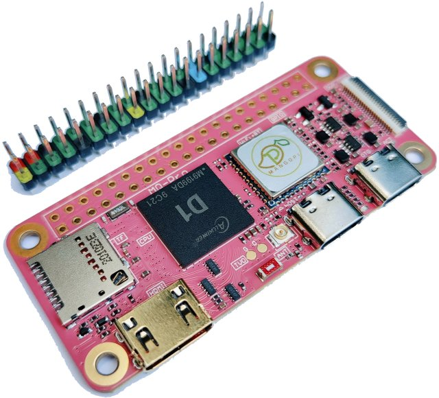
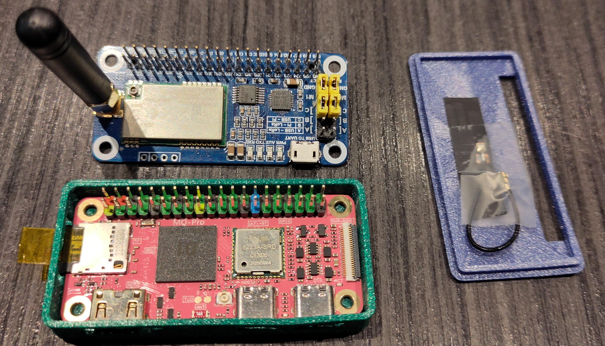

# MangoPI MQ Pro Install guide for Ubuntu Server 24.04.1

The MQ pro is a single core RISC-V allwinner D1 64bit 1Ghz CPU, with 1Gb RAM, HDMI and Wifi, in a Pi-Zero form factor Single Board Computer.

It runs Linux, and is quite usable as a small headless (networked, non GUI) machine.



## This is a guide for Installing Ubuntu 24.04.1, enabling Bluetooth and using the correct Device Tree for this board

Ubuntu Server `24.04.1` is a LTS+ release and should provide 5+ years of updates. It is a good choice for an unattended headless device.

Unfortunately there is no [Official Ubuntu image](https://ubuntu.com/download/risc-v) for the MQ Pro, but you can use the image for the SiPeed LicheeRV. This has the same SOC as the MQ-Pro, and boots properly.

Once the LicheeRV image is booted you can swap the device tree it uses for the MQ-Pro one.
- The correct MangoPI MQ Pro device tree *is* available in the firmware package, but is not the default installed by `flash-kernel`.
  - It is provided in the `linux-modules-<kernel version>` package for each kernel.
- You can reconfigure `flash-kernel` to always select the MQ-Pro tree instead of the Lichee RV default in config.
  - This is future proof
  - Each new kernel release also delivers a new set of device trees that to be installed as the kernel image is created.

The idea of compiling a custom Device Tree is depreciated in favor of the vanilla MQ-Pro device tree and using [gpiod](https://www.kernel.org/doc/html/v4.17/driver-api/gpio/index.html) and [pinctl](https://www.kernel.org/doc/html/v4.15/driver-api/pinctl.html) to setup devices.
- However, I also have instructions for doing this, for those who like to tinker.

-----------------------------

## Install Steps
If you have set up SD card based systems before the following should feel familiar. You will need a SD card to boot and run the system.
- I had issues getting a successful first boot with a *generic* cheap SD card, using a brand-name (Kingston) high speed card solved all the issues.
- I am also using a high wear resistance card since I want this to run for years in a hard-to-reach location.

### Notes
Unfortunately HDMI only starts very late in the boot process, you cannot use it to select GRUB options, and the console is not usable until the boot is complete.
- You may see some output appear and then it freezes, this is normal. It will recover in time for the `login: ` prompt.
- Once the console login is available You can use a USB keyboard with it, and install `gpm` to get a working mouse. 
- Once I had bluetooth working I was able to attach and use a bluetooth kbd+mouse.

If you have a USB serial adapter available you can follow the entire boot process
- This is the only way to access the GRUB prompt and select recovery options etc!
- Make sure your adapter is set to 3.3v and *not* 5v. This is important.
- Attach `gnd`, `tx` and `rx` to pins `6`, `8` and `10` on the GPIO header.
- See Jeff Geerlings excellent '[serial console uart debugging](https://www.jeffgeerling.com/blog/2021/attaching-raspberry-pis-serial-console-uart-debugging) article for a good description. His example is for a Raspberry PI, but MQ Pro is *identical* to a Pi for this.

The WiFi module will be detected, but will not connect to any networks unless preconfigured on the SD card before first boot.
- The instructions below show how to do this. (Requires a linux machine to mount & modify the SD card.)
- Alternatively, wait for the console boot to finish and configure the network on that using netplan, this is also covered below.

If you have a Linux compatible USB Ethernet adapter you can attach that to the spare USB-C port on the MQ-Pro.
- It will be detected and connected (using DHCP) during boot.
- You will need to find the assigned IP from router logs, netscan, or looking on the console.

### Creating SD card
You will need a suitable machine to download the image file to, with a SD card writer so the image can be written. 
- The instructions below are for a generic Linux system with a sd card writer.
  - As ever with this sort of operation make *absolutely* sure you are using the correct disk device when writing.
- Windows users need to ignore the linux steps and use a tool such as Belena Etcher or similar to burn the SD card, before skipping to [first boot](#first-boot).

Get the image file; (as of 2-Sep-2024 the url below works).
```text
$ wget https://cdimage.ubuntu.com/releases/noble/release/ubuntu-24.04.1-preinstalled-server-riscv64+licheerv.img.xz
```

Unpack and copy the downloaded image to the SD card:
```text
$ xzcat ubuntu-24.04.1-preinstalled-server-riscv64+licheerv.img.xz | sudo dd bs=8M conv=fsync status=progress of=/dev/<SD_DEVICE_HERE>
```

If you are going to configure Wifi/Network via the console or using a USB Ethernet adapter you can skip to [`First Boot`](#first-boot) below.

#### Preconfiguring WiFi networks

Mount the SD card you just created:
```text
$ sudo mount /dev/mmcblk1p1 /mnt
```
Create a new network config file that will be applied at first init:

As root; edit `/mnt/etc/cloud/cloud.cfg.d/55_net.cfg`

It should have the following contents:
```yaml
network:
    version: 2
    wifis:
        wlan0:
            optional: true
            access-points:
                "SSID":
                    password: "PASSWORD"
            dhcp4: true
```
- Replace 'SSID' and 'PASSWORD' with your details, multiple ssid/password line pairs are allowed.
- Be careful editing [YAML](https://www.redhat.com/sysadmin/yaml-beginners) files, the indentation must be *exact* and *consistent* (especially; do not mix tabs and spaces!).
- This is for a very simple 'connect to accesspoint' scenario.
  - The Netplan syntax allows almost any possible Network setup to be preconfigured!
  - See the [Netplan Documentation](https://netplan.readthedocs.io/en/stable/examples/) for lots of examples and the full syntax.
- After first boot this file will be copied (with some comments) to `/etc/netplan/50-cloud-init.yaml`.
  - If you made a mistake in the config, or need to change details, edit it in `/etc/netplan/` and use `netplan try` to test the new configuration.

Unmount the filesystem so that it is synced properly.
```text
$ sudo umount /mnt
```
Eject the SD card.

### First Boot
Insert the SD card into the MQ Pro and apply power.
- First boot is SLOW. It will take 5+ minutes before anything useful appears on HDMI.
  - This is where a serial adapter is handy for following progress.
- The HDMI console first appears after several minutes but then freezes soon after!
  - Do not panic, wait, HDMI recovers after some time as the login prompt appears.

Once the machine has booted you can login via console or SSH as `ubuntu:ubuntu`, and follow the mandatory instructions to change password.

#### WiFi config after first boot
If you are setting up WiFI *after* first boot you can use [`netplan`](https://netplan.io) to configure the WiFi.

Create and edit a file in the netplan config:
```text
$ sudo vi /etc/netplan/55-wifi.yaml
```
The contents of this are ***identical*** to the [precofigured WiFi](#preconfiguring-wifi-networks) setup given above.
- Copy the `yaml` definition given there to this file and edit with your details.
- The comments for the file there also apply here.

Apply and test your edits with:
```text
$ netplan try
```
This will test your new config and reject it after a time unless you actively accept it. A very useful command.

### Reconfigure to use MangoPI Device Tree

You should now have bootable machine you can access via the console or SSH. We can now reconfigure this to use the MQ Pro device tree via [`flash-kernel`](https://manpages.debian.org/testing/flash-kernel/flash-kernel.8.en.html).

As root; edit `/etc/flash-kernel/db`

Append the following after the comments:
```text
Machine: MangoPI MQ pro
Kernel-Flavors: any
DTB-Id: allwinner/sun20i-d1-mangopi-mq-pro.dtb
Boot-Script-Path: /boot/boot.scr
U-Boot-Script-Name: bootscr.uboot-generic
Required-Packages: u-boot-tools
```
This adds a new custom entry for the MQ Pro based on the default LicheeRV definition from `/usr/share/flash-kernel/db/all.db`, but with the correct name and device tree.

Make this the default with:
```console
ubuntu@ubuntu:~$ sudo echo 'MangoPI MQ pro' > /etc/flash-kernel/machine
```
We now apply this by running `flash-kernel` manually.
* *flash-kernel* will also be run automatically by `apt` and `dpkg` whenever kernel images are (re)installed.
```console
ubuntu@ubuntu:~$ sudo flash-kernel
Using DTB: allwinner/sun20i-d1-mangopi-mq-pro.dtb
Installing /lib/firmware/6.8.0-41-generic/device-tree/allwinner/sun20i-d1-mangopi-mq-pro.dtb into /boot/dtbs/6.8.0-41-generic/allwinner/sun20i-d1-mangopi-mq-pro.dtb
Taking backup of sun20i-d1-mangopi-mq-pro.dtb.
Installing new sun20i-d1-mangopi-mq-pro.dtb.
System running in EFI mode, skipping.
```
This installs a copy of the `.dtb` into the `/boot/dtbs/` tree and softlinks it there to be the default.

Reboot the system and you will be using the new device tree.
```text
$ sudo reboot
# .. wait while it reboots then login again
$ cat /proc/device-tree/model
```
This should return `MangoPi MQ Pro`

### First Update
```text
$ apt update
```
Let this run
- It will eventually tell you that a lot of packages need updating
```text
$ apt upgrade
```
You may see packages 'deferred due to phasing', this is quite normal, an artifact of Ubuntu's build system. These can safely be ignored.

When this completes reboot again, or finish the BT setup below first since it also needs a reboot.

### Setup Bluetooth adapter
Get the Bluetooth firmware files, they can be found online, but there is a copy in my repo for convenience.
```text
$ git clone https://github.com/easytarget/MQ-Pro-IO.git
```
Copy Bluetooth firmware to the system firmware tree.
```text
$ sudo cp MQ-Pro-IO/files/rtl_bt/* /usr/lib/firmware/rtl_bt/
```
 Before you reboot to apply these you should also install `bluez`, which allows you to use `bluetoothctl` to connect and pair,etc
```text
$ sudo apt install bluez
$ sudo reboot
```
### Set up a service for the activity light
```text
$ sudo cp MQ-Pro-IO/files/mqpro-status-led.service /etc/systemd/system/
$ sudo systemctl daemon-reload
$ sudo systemctl enable --now mqpro-status-led.service
```
The Status LED should now be continually flashing with Network activity, there is more on controlling this below.

## Bask in glory!
Congratulations! 🎉

You now have a small Risc-V server that should run and be updated for several years. What you do with it is up to you!

--------------------------------------------------------------------

# Device Trees
In the install steps above we reconfigure the system to use the correct MangoPI MQ pro device tree instead of the Sipeed Lichee RV one.

A device tree is a file in the `/boot/` area that defines the structure of the hardware provided by the chipset and SBC.

It is used in several places during initial boot to discover storage, console and other devices as needed. Once the linux kernel starts it is used to provision devices such as UART, network, gpu and other hardware. The device tree itself is a source file that is compiled into a binary to be loaded during boot.

In this guide we only replace the device tree used by the kernel when Linux is started in the final stages of boot up.

We do not need to modify the device tree used by U-Boot, or the kernel init processes, they still use the default (Sipeed Lichee RV) device tree they were compiled against. Because this part of the boot process already works correctly we can avoid the complexity of recompiling anything.

## Device Tree Overlays
The 'vanilla', empty, device tree we installed above only enables the console UART on the GPIO connector, no other pins are assigned.

In order to enable devices (such as UART, I2C, SPI, etc) on the MQ pro's GPIO connector you need to 'add' an assignment to it via a 'Device Tree Overlay'

**I am working on this but do not (yet) have any working examples**

I will update this guide once I have worked it out.. 

***In the meantime you can proceed with a full device tree modification***

See below:

## Roll Your Own Device Tree
Hopefully you can do what you need with the default tree and an overlay.

But if not; my somewhat limited notes on compiling the tree, plus a script that handles running the C preprocessor on them (needed to get a working binary) are in the [build-trees](./build-trees) folder. There are also instructions on how to configure *flash-kernel* to override the upstream trees with localally built ones.


## My Motivation:
My MQ PRO is connected to a Waveshare LORA hat, I want to make it work but the default device tree conflicts with some of the pins my HAT uses. So I decided to 'fix' this by putting a better device tree on my board.



## MQ Pro GPIO
Providing a full GPIO how-to is beyond the scope of this document, I use LGPIO in python to do this. 

**IN PROGRESS** : create a seperate guide doc [GPIO-examples](GPIO-examples) showing my GPIO tests/use.

## Allwinner D1 GPIO pins
The **D1** SOC runs at 3v3, and you must not exceed this on any of the GPIO pins. The drive current is also very limited, a maximum of 4mA on any individual pin, and 6mA total across a bank of pins (eg the 12 pins in the `*PB*` bank combined cannot draw more than 6mA!).

Pins are organised into 7 'banks' (*PA*, *PB*, etc to *PG*) of up to 32 pins, but most banks have fewer pins.

## GPIO Pin Muxing
The **D1** SOC itself has 88 GPIO pins.

In the MQ PRO some of these GPIO pins are wired directly to peripherals on the board (eg SD card, Wifi chip, etc.) but that still leaves many free lines.

The board has a 'standard' Raspberry Pi compatible 40 pin GPIO connector; 12 are reserved for Power lines, leaving 28 GPIO pins available for the user.

Internally, the **D1** has a number of internal hardware interfaces for different signal types; 6x UART for serial, 2x SPI, 4x I2C(TWI), 3x I2S/PCM (audio), 8x PWM, and some additional units for USB, HDMI, Audio, and more (see the Data sheet).

The **D1** chip uses a 'pin muxer' to connect pins to signals. Each pin can connect to a (predefined) set of signals, which allows you to map each pin on the GPIO header to multiple possible functions.

You can browse the full range of mappings in the Allwinner D1 datasheet, Table 4-3.
- A copy of this table is available here: [reference/d1-pins.pdf](reference/d1-pins.pdf)).
- Note: Allwinner use the acronym **TWI** (Two Wire Interface) in place of **I2C** in their documentation.

All pins are high-impedance digital inputs by default, they all have configurable pull-up and pull-down resistors, and can generate interrupts. Every pin can also be set to a HIGH or LOW digital output. PWM output and ADC input capable pins are limited, see the datasheet for more.

## MQ Pro GPIO connector

### Pinmux assignment
Each pin on the connector has a 'pinmux' number, these map to the GPIO connector like this:
```
Gpio Header:
   pinmux   des  pin       pin  des   pinmux
            3v3   1 --o o-- 2   5v
      205  PG13   3 --o o-- 4   5v
      204  PG12   5 --o o-- 6   gnd
       39   PB7   7 --o o-- 8   PB8   40
            gnd   9 --o o-- 10  PB9   41
      117  PD21  11 --o o-- 12  PB5   37
      118  PD22  13 --o o-- 14  gnd
       32   PB0  15 --o o-- 16  PB1   33
            3v3  17 --o o-- 18  PD14  110
      108  PD12  19 --o o-- 20  gnd                              
      109  PD13  21 --o o-- 22  PC1   65
      107  PD11  23 --o o-- 24  PD10  106
            gnd  25 --o o-- 26  PD15  111
      145  PE17  27 --o o-- 28  PE16  144
       42  PB10  29 --o o-- 30  gnd
       43  PB11  31 --o o-- 32  PC0   64
       44  PB12  33 --o o-- 34  gnd
       38   PB6  35 --o o-- 36  PB2   34
      113  PD17  37 --o o-- 38  PB3   35
            gnd  39 --o o-- 40  PB4   36
Also:
  PD18: Blue Status Led - pinmux 114
```

When controlling pins via the (legacy) `/sys/class/gpio` interface or `lgpio` in Python you need to use this pinmux number when addressing them.

You can query the current pin mapping at any time with:
```
$ sudo cat /sys/kernel/debug/pinctrl/2000000.pinctrl/pinmux-pins
```
This produces a long output that lists all the D1's gpio pins and states, not just the pins exposed on the GPIO connector.
* The `list-pins.py` tool in the [tools](tools) folder uses the output from the above and displays the a diagram of the just the GPIO connector pins and their assignments.

### Functional assignments
The following shows all the function combinations available on the MQ Pro GPIO connector.
* **All** pins can also do Digital Input and Output when not assigned to a specific internal interface.
* I do not list all interface types here, eg SPI (audio) and IR functions are available on GPIO pins but not covered in this guide. Creating overlays and using them is quite possible but I do not need these features and have limited resources, so I leave it as an excercise for others / the future. Sorry..

```text
Gpio Header:
                                        func   des  pin       pin  des   func
                                               3v3   1 --o o-- 2   5v
                   i2c0-sda, uart1-rx, pwm-2  PG13   3 --o o-- 4   5v
                   i2c0-scl, uart1-tx, pwm-0  PG12   5 --o o-- 6   gnd
                          i2c3-sda, uart3-rx   PB7   7 --o o-- 8   PB8   i2c2-sck, spi1-hold, uart0-tx, uart1-tx, pwm-5
                                               gnd   9 --o o-- 10  PB9   i2c2-sda, spi1-miso, uart0-rx, uart1-rx, pwm-6
                   i2c2-sda, uart1-tx, pwm-5  PD21  11 --o o-- 12  PB5   i2c1-sda, uart5-rx,pwm-0
                             uart1-rx, pwm-7  PD22  13 --o o-- 14  gnd
i2c2-sck, spi1-wp, uart0-tx, uart2-tx, pwm-3   PB0  15 --o o-- 16  PB1   i2c2-sda, uart0-rx, uart2-rx, pwm-4
                                               3v3  17 --o o-- 18  PD14  spi1-hold, uart3-cts
                         i2c0-sda, spi1-mosi  PD12  19 --o o-- 20  gnd
                        spi1-miso, uart3-rts  PD13  21 --o o-- 22  PC1   i2c2-sda, uart2-rx
                          spi1-clk, uart3-rx  PD11  23 --o o-- 24  PD10  spi1-cs, uart3-tx
                                               gnd  25 --o o-- 26  PD15  spi1-wp
                                    i2c3-sda  PE17  27 --o o-- 28  PE16  i2c3-sck, pwm-7
       i2c0-sck, spi1-mosi, uart1-rts, pwm-7  PB10  29 --o o-- 30  gnd
        i2c0-sda, spi1-clk, uart1-cts, pwm-2  PB11  31 --o o-- 32  PC0   i2c2-sck, uart2-tx
                              spi1-cs, pwm-0  PB12  33 --o o-- 34  gnd                              
                   i2s3-sck, uart3-tx, pwm-1   PB6  35 --o o-- 36  PB2   i2c0-sda, uart4-tx
                                       pwm-1  PD17  37 --o o-- 38  PB3   i2c0-sck, uart4-rx
                                               gnd  39 --o o-- 40  PB4   i2c1-sck, uart5-tx
Notes:
- I2C pins 3,5,27 and 28 (PG13, PG12, PE17 and PE16) have 10K pullup resistors to 3v3
```

### Internal interfaces
The MQ Pro uses several of the **D1**s interfaces on-board, specifically:
* `UART1` is used to connect to the the bluetooth device by default (with flow control) using `PG6`, `PG7`, `PG8` and `PG9`. It can be reconfigured onto GPIO pins if bluetooth is not required.
* `TWI2` (`I2C2`) can be mapped to the DVP connector (for touchscreen interfaces) via pins `PE12` and `PE13`.
* `TWI3` (`I2C3`) can be mapped to the DSI/LVDS connector via pins `PE16` and `PE17`; which also appear on the GPIO connector.
* `SPI0` is mapped to the optional SPI flash chip (not fitted on consumer units), and cannot be mapped to the GPIO connector. It is present but `disabled` in the device tree by default.

## References
There are reference copies of the MQ PRO schematic and the AllWinner D1 datasheet in the [references](./reference) folder.

Online:
* https://mangopi.org/mangopi_mqpro
* https://linux-sunxi.org/MangoPi_MQ-Pro
* https://github.com/boosterl/awesome-mango-pi-mq-pro

